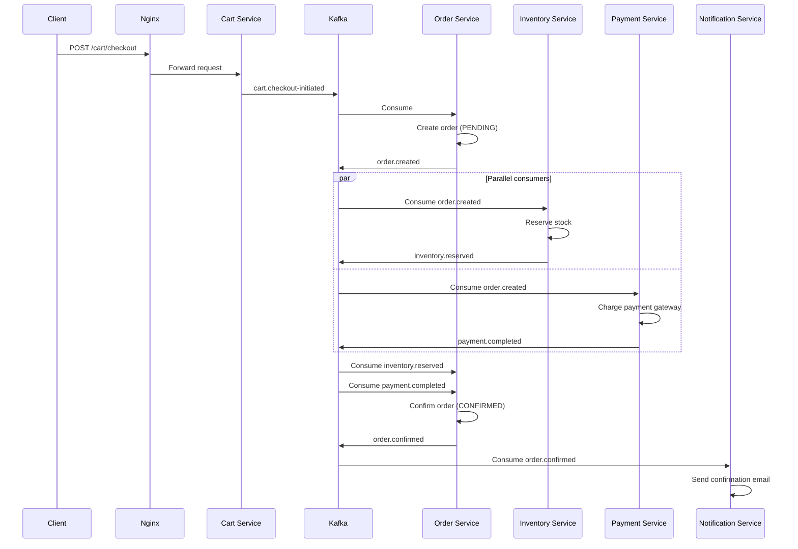
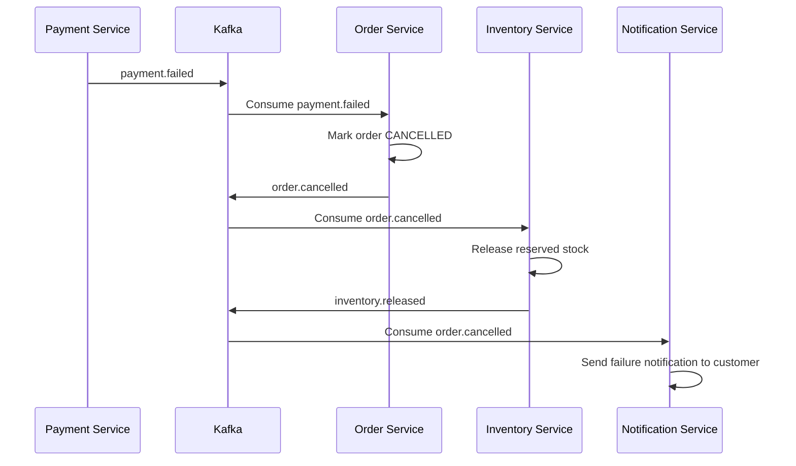
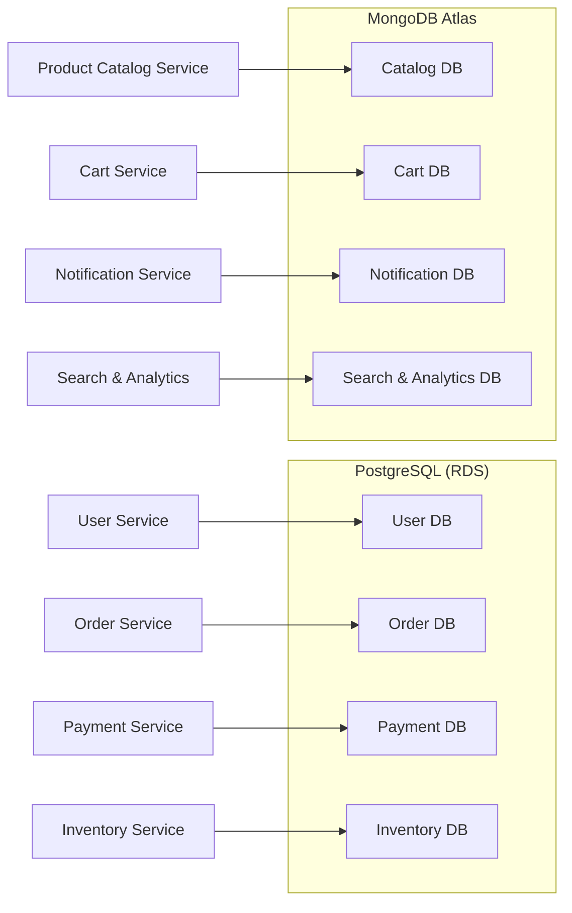

# Product Requirements Document
## Event-Driven E-Commerce Platform

| Field | Value |
|---|---|
| **Version** | 1.0 — Draft |
| **Date** | 2026-04-16 |
| **Author** | Backend Architecture Team |
| **Status** | Awaiting Review |

---

## 1. Executive Summary

This document defines the architecture and product requirements for a **cloud-native, event-driven e-commerce platform** built on a microservices foundation. The system is designed for horizontal scalability, resilience, and team autonomy — enabling independent deployment of services while maintaining strong data consistency guarantees through Apache Kafka–based asynchronous communication.

### 1.1 Guiding Principles

| Principle | Implication |
|---|---|
| **Database-per-service** | Each microservice owns its data store; no cross-service DB joins |
| **Event-first communication** | Services emit domain events to Kafka; downstream services react asynchronously |
| **Polyglot persistence** | PostgreSQL for transactional/relational data, MongoDB for document/search workloads |
| **Infrastructure as commodity** | Managed services (RDS, Atlas, MSK/Confluent) wherever possible to reduce ops burden |
| **Failure is expected** | Circuit breakers, dead-letter queues, idempotent consumers, and Saga-based rollbacks are first-class concerns |

---

## 2. Technology Stack

| Layer | Technology | Purpose |
|---|---|---|
| **Frontend** | Next.js (TypeScript) | SSR/SSG storefront, SEO-optimised pages, API-route BFF layer |
| **API Gateway / Reverse Proxy** | Nginx | TLS termination, rate limiting, load balancing, routing to backend services |
| **Backend Services** | Node.js + Express (TypeScript) | Individual microservice runtimes |
| **Message Broker** | Apache Kafka | Durable, ordered, partitioned event streaming between services |
| **Relational Database** | PostgreSQL (AWS RDS) | Transactional data (users, orders, payments, inventory) |
| **Document Database** | MongoDB Atlas | Flexible-schema data (product catalog, cart snapshots, analytics, search projections) |
| **Cache (optional, recommended)** | Redis | Session store, rate-limit counters, hot-path caching |

---

## 3. High-Level Architecture

```
┌─────────────────────────────────────────────────────────────────────┐
│                          CLIENTS                                    │
│              (Browser · Mobile App · Third-Party)                    │
└──────────────────────────┬──────────────────────────────────────────┘
                           │  HTTPS
                           ▼
               ┌───────────────────────┐
               │        NGINX          │
               │  (API Gateway / LB)   │
               │  TLS · Rate Limit     │
               │  /api/* → Services    │
               │  /*     → Next.js     │
               └───────────┬───────────┘
                           │
          ┌────────────────┼─────────────────┐
          ▼                ▼                  ▼
   ┌────────────┐  ┌──────────────┐   ┌──────────────┐
   │  Next.js   │  │  Service A   │   │  Service N   │
   │  (BFF /    │  │  (Express)   │   │  (Express)   │
   │  Storefront)│  └──────┬───────┘   └──────┬───────┘
   └────────────┘         │                   │
                          │   Produce / Consume
                          ▼                   ▼
               ┌─────────────────────────────────┐
               │         APACHE KAFKA            │
               │  (Topics · Partitions · Groups) │
               └──────────────┬──────────────────┘
                              │
        ┌─────────────┬───────┴───────┬─────────────┐
        ▼             ▼               ▼             ▼
  ┌───────────┐ ┌───────────┐  ┌───────────┐ ┌───────────┐
  │ PostgreSQL│ │ PostgreSQL│  │ MongoDB   │ │ MongoDB   │
  │ (User DB) │ │ (Order DB)│  │ (Catalog) │ │ (Analytics│
  └───────────┘ └───────────┘  └───────────┘ └───────────┘
```

> [!NOTE]
> Each service exposes a REST API for synchronous queries (reads) and publishes domain events to Kafka for state changes (writes). The Next.js BFF aggregates data from multiple services to compose pages.

---

## 4. Microservices Breakdown

### 4.1 User Service

| Attribute | Detail |
|---|---|
| **Responsibility** | Registration, authentication (JWT), profile management, address book |
| **Database** | **PostgreSQL** — relational user data, roles, hashed credentials |
| **Key Endpoints** | `POST /auth/register`, `POST /auth/login`, `GET /users/:id`, `PUT /users/:id` |
| **Events Produced** | `user.registered`, `user.profile-updated` |
| **Events Consumed** | — |

**Rationale for PostgreSQL:** User records are highly relational (addresses, roles, audit trails) and require ACID transactions for credential updates.

---

### 4.2 Product Catalog Service

| Attribute | Detail |
|---|---|
| **Responsibility** | Product CRUD, categories, variants, images, pricing |
| **Database** | **MongoDB Atlas** — flexible schemas for variant-heavy product data |
| **Key Endpoints** | `GET /products`, `GET /products/:id`, `POST /products` (admin), `PUT /products/:id` (admin) |
| **Events Produced** | `product.created`, `product.updated`, `product.price-changed`, `product.discontinued` |
| **Events Consumed** | — |

**Rationale for MongoDB:** Product documents vary wildly in shape (clothing has sizes/colours; electronics have specs). A document model avoids an explosion of join tables and allows embedding of variant arrays.

---

### 4.3 Cart Service

| Attribute | Detail |
|---|---|
| **Responsibility** | Manage shopping cart state (add, remove, update qty), apply promo codes |
| **Database** | **MongoDB Atlas** — ephemeral, per-session documents; flexible line-item schema |
| **Key Endpoints** | `GET /cart`, `POST /cart/items`, `DELETE /cart/items/:itemId`, `POST /cart/checkout` |
| **Events Produced** | `cart.checkout-initiated` |
| **Events Consumed** | `product.price-changed` (to update cached prices in active carts) |

**Rationale for MongoDB:** Carts are short-lived, schema-flexible documents. Heavy write throughput on adds/removes favours a document store. Abandoned carts are TTL-expired.

---

### 4.4 Order Service

| Attribute | Detail |
|---|---|
| **Responsibility** | Order creation, lifecycle management, status tracking, order history |
| **Database** | **PostgreSQL** — orders, order-items, status history (strong consistency required) |
| **Key Endpoints** | `POST /orders`, `GET /orders/:id`, `GET /orders?userId=`, `PUT /orders/:id/cancel` |
| **Events Produced** | `order.created`, `order.confirmed`, `order.shipped`, `order.delivered`, `order.cancelled` |
| **Events Consumed** | `cart.checkout-initiated`, `payment.completed`, `payment.failed`, `inventory.reserved`, `inventory.reservation-failed` |

**Rationale for PostgreSQL:** Orders are financial records requiring strict ACID guarantees, foreign-key integrity, and audit-friendly relational modelling.

---

### 4.5 Payment Service

| Attribute | Detail |
|---|---|
| **Responsibility** | Payment processing, refunds, integration with external gateways (Stripe / Razorpay) |
| **Database** | **PostgreSQL** — transaction ledger, payment method references |
| **Key Endpoints** | `POST /payments/initiate`, `POST /payments/webhook` (gateway callback), `GET /payments/:orderId` |
| **Events Produced** | `payment.completed`, `payment.failed`, `payment.refunded` |
| **Events Consumed** | `order.created` |

**Rationale for PostgreSQL:** Financial transactions demand ACID, double-entry-style ledger integrity, and point-in-time auditability.

---

### 4.6 Inventory Service

| Attribute | Detail |
|---|---|
| **Responsibility** | Stock levels, warehouse locations, reservation/release during checkout |
| **Database** | **PostgreSQL** — inventory counts require row-level locking and atomic decrements |
| **Key Endpoints** | `GET /inventory/:productId`, `PUT /inventory/:productId` (admin restock) |
| **Events Produced** | `inventory.reserved`, `inventory.reservation-failed`, `inventory.released`, `inventory.low-stock` |
| **Events Consumed** | `order.created` (reserve stock), `order.cancelled` (release stock), `payment.failed` (release stock) |

**Rationale for PostgreSQL:** Inventory counts are a textbook case for serializable transactions. Optimistic or pessimistic locking prevents overselling under concurrent checkout pressure.

---

### 4.7 Notification Service

| Attribute | Detail |
|---|---|
| **Responsibility** | Send transactional emails, SMS, push notifications |
| **Database** | **MongoDB Atlas** — notification log / outbox (append-heavy, TTL-indexed) |
| **Key Endpoints** | Internal only (no external API) |
| **Events Produced** | `notification.sent`, `notification.failed` |
| **Events Consumed** | `user.registered`, `order.confirmed`, `order.shipped`, `payment.completed`, `payment.refunded`, `inventory.low-stock` |

**Rationale for MongoDB:** Notification logs are append-only, high-volume, and don't require relational integrity. TTL indexes auto-expire old records.

---

### 4.8 Search & Analytics Service

| Attribute | Detail |
|---|---|
| **Responsibility** | Full-text product search, faceted filtering, business analytics & reporting |
| **Database** | **MongoDB Atlas** (with Atlas Search) — materialised read projections optimised for query patterns |
| **Key Endpoints** | `GET /search?q=&filters=`, `GET /analytics/dashboard` (admin) |
| **Events Produced** | — |
| **Events Consumed** | `product.created`, `product.updated`, `order.confirmed`, `order.delivered`, `user.registered` |

**Rationale for MongoDB:** Atlas Search provides built-in Lucene-backed full-text search without a separate Elasticsearch cluster. Analytics aggregations are well-served by MongoDB's aggregation pipeline.

---

## 5. Kafka Event Flow

### 5.1 Topic Design

| Topic Name | Partitions | Key | Producers | Consumers |
|---|---|---|---|---|
| `ecom.user.events` | 6 | `userId` | User Service | Notification, Analytics |
| `ecom.product.events` | 12 | `productId` | Product Catalog | Cart, Search & Analytics, Inventory |
| `ecom.cart.events` | 12 | `userId` | Cart Service | Order Service |
| `ecom.order.events` | 12 | `orderId` | Order Service | Payment, Inventory, Notification, Analytics |
| `ecom.payment.events` | 12 | `orderId` | Payment Service | Order, Inventory, Notification |
| `ecom.inventory.events` | 6 | `productId` | Inventory Service | Order, Notification, Analytics |
| `ecom.notification.events` | 6 | `notificationId` | Notification Service | Analytics (delivery tracking) |
| `ecom.dlq.*` | 3 | original key | Any service | Ops / Retry workers |

> [!IMPORTANT]
> **Partition keys** are chosen to guarantee ordering within a single entity (e.g., all events for one order land on the same partition). This prevents out-of-order processing of `order.created` → `payment.completed` → `order.confirmed`.

### 5.2 Event Envelope Schema

Every event published to Kafka follows a canonical envelope:

```
{
  "eventId":        "uuid-v4",          // Idempotency key
  "eventType":      "order.created",    // Dot-namespaced type
  "aggregateId":    "ord_abc123",       // Entity ID
  "aggregateType":  "Order",
  "timestamp":      "ISO-8601",
  "version":        1,                  // Schema version (for evolution)
  "source":         "order-service",
  "correlationId":  "uuid-v4",          // Trace across services
  "payload":        { ... }             // Domain-specific data
}
```

### 5.3 Primary Event Flow — Checkout



### 5.4 Failure Flow — Payment Failed



---

## 6. Database-Per-Service Summary



| Database | Engine | Key Design Decisions |
|---|---|---|
| User DB | PostgreSQL | Normalised schema; bcrypt-hashed passwords; `pgcrypto` for encryption at rest |
| Catalog DB | MongoDB | Embedded variants & media arrays; text indexes for basic search |
| Cart DB | MongoDB | TTL index on `updatedAt` (expire abandoned carts after 7 days) |
| Order DB | PostgreSQL | `orders` ↔ `order_items` ↔ `status_history`; immutable status log |
| Payment DB | PostgreSQL | Append-only ledger; soft deletes; PCI-compliant tokenised references |
| Inventory DB | PostgreSQL | `SELECT ... FOR UPDATE` on stock rows during reservation |
| Notification DB | MongoDB | Append-only log; TTL-indexed (90-day retention) |
| Search DB | MongoDB | Materialised view rebuilt from Kafka events; Atlas Search indexes |

> [!WARNING]
> **No service may directly query another service's database.** All cross-service data access must happen via REST API calls (synchronous reads) or Kafka events (asynchronous state propagation). Violating this boundary reintroduces tight coupling and makes independent deployment impossible.

---

## 7. Nginx Configuration Strategy

Nginx sits as the single entry point and is responsible for:

| Concern | Implementation |
|---|---|
| **TLS Termination** | Terminate HTTPS at Nginx; backend communication is plain HTTP over a private network |
| **Path-Based Routing** | `/api/users/*` → User Service, `/api/products/*` → Catalog Service, etc. |
| **Static / SSR Routing** | `/*` → Next.js (storefront) |
| **Rate Limiting** | `limit_req_zone` per IP; stricter limits on auth endpoints |
| **Load Balancing** | `upstream` blocks with `least_conn` strategy per service |
| **Health Checks** | Active health checks against `/health` on each upstream |
| **Request Buffering** | Buffer large request bodies (image uploads) to protect backend services |
| **CORS Headers** | Centralised CORS policy to avoid per-service duplication |

### Routing Map

```
location /api/users/    → upstream user_service
location /api/products/ → upstream catalog_service
location /api/cart/     → upstream cart_service
location /api/orders/   → upstream order_service
location /api/payments/ → upstream payment_service
location /api/inventory/→ upstream inventory_service
location /api/search/   → upstream search_service
location /              → upstream nextjs_app
```

---

## 8. Failure Handling Strategy

### 8.1 Dead-Letter Queues (DLQs)

Every Kafka consumer group has a paired DLQ topic (`ecom.dlq.<service-name>`). After **3 retry attempts** with exponential backoff (1s → 5s → 25s), the message is routed to the DLQ for manual inspection and replay.

### 8.2 Idempotent Consumers

All consumers must be idempotent. Strategy:

1. Every event carries a unique `eventId`.
2. Consumers maintain a **processed-events table** (or MongoDB collection).
3. Before processing, check if `eventId` has already been handled.
4. Insert `eventId` **within** the same database transaction as the business logic (PostgreSQL) or use `findOneAndUpdate` with upsert (MongoDB).

### 8.3 Saga Pattern — Choreography-Based

The checkout flow uses a **choreography Saga** (no central orchestrator). Each service listens for events and emits compensating events on failure:

| Step | Service | Success Event | Failure → Compensating Action |
|---|---|---|---|
| 1. Create order | Order Service | `order.created` | N/A (first step) |
| 2. Reserve stock | Inventory Service | `inventory.reserved` | `inventory.reservation-failed` → Order Service cancels order |
| 3. Process payment | Payment Service | `payment.completed` | `payment.failed` → Order Service cancels order → Inventory releases stock |
| 4. Confirm order | Order Service | `order.confirmed` | N/A (all preconditions met) |

> [!CAUTION]
> **Compensating transactions are not rollbacks.** They are new forward-moving events that undo the semantic effect of a prior step. The system must tolerate windows of inconsistency (eventual consistency) between the failure event and the compensating action completing.

### 8.4 Circuit Breakers (Synchronous Calls)

For the limited synchronous HTTP calls (e.g., Next.js BFF → Service, Payment Service → Stripe API):

- Use a circuit breaker library (e.g., `opossum` for Node.js).
- **Thresholds:** Open circuit after 5 failures in a 30-second window; half-open after 15 seconds.
- **Fallback behaviour:** Return cached data (for reads) or queue the request for retry (for writes).

### 8.5 Timeout & Retry Policy

| Call Type | Timeout | Retries | Backoff |
|---|---|---|---|
| Service ↔ Service (HTTP) | 5 seconds | 2 | Exponential (500ms, 1s) |
| Service → External Gateway | 10 seconds | 3 | Exponential (1s, 3s, 9s) |
| Kafka consumer processing | 30 seconds | 3 | Exponential (1s, 5s, 25s) → DLQ |

### 8.6 Observability

| Signal | Tooling |
|---|---|
| **Distributed Tracing** | OpenTelemetry SDK → Jaeger / Grafana Tempo; `correlationId` propagated via Kafka headers and HTTP headers |
| **Structured Logging** | `pino` (JSON logs) → centralised log aggregation (ELK / Loki) |
| **Metrics** | Prometheus client (`prom-client`) → Grafana dashboards |
| **Alerting** | Grafana alerts on: consumer lag > threshold, DLQ message count > 0, circuit breaker open, error rate > 1% |

---

## 9. Non-Functional Requirements

| Requirement | Target |
|---|---|
| **Availability** | 99.9% uptime (≈ 8.7 hours downtime/year) |
| **Latency (P95)** | Storefront page load < 400ms (SSR); API response < 200ms |
| **Throughput** | Support 500 concurrent checkouts/minute at launch |
| **Scalability** | Horizontal scaling of any service independently; Kafka partitions enable parallel consumers |
| **Data Durability** | Kafka retention: 7 days; PostgreSQL: daily automated backups with 30-day retention; MongoDB Atlas: continuous backup |
| **Security** | JWT-based auth (short-lived access + refresh tokens); bcrypt password hashing; input validation (Zod); Helmet.js headers; parameterised queries |
| **Compliance** | PCI-DSS: no raw card data stored; tokenised via payment gateway; HTTPS everywhere |

---

## 10. Delivery Roadmap

### Phase 1 — Foundation (Weeks 1–4)
- [ ] Monorepo setup (Turborepo) with shared TypeScript config and packages
- [ ] Nginx gateway + Next.js storefront skeleton
- [ ] User Service (auth, JWT, profile)
- [ ] Product Catalog Service (CRUD, seeded data)
- [ ] Kafka cluster provisioning + shared event library
- [ ] CI/CD pipeline (lint → test → build → deploy)

### Phase 2 — Core Commerce (Weeks 5–8)
- [ ] Cart Service (add/remove/checkout)
- [ ] Order Service (Saga-based checkout flow)
- [ ] Payment Service (Stripe integration, webhooks)
- [ ] Inventory Service (reservation, release)
- [ ] End-to-end checkout event flow validated

### Phase 3 — Intelligence & Ops (Weeks 9–12)
- [ ] Notification Service (email via SendGrid/SES)
- [ ] Search & Analytics Service (Atlas Search, dashboards)
- [ ] Observability stack (tracing, logging, metrics, alerting)
- [ ] DLQ monitoring and replay tooling
- [ ] Load testing and performance tuning

### Phase 4 — Hardening (Weeks 13–14)
- [ ] Security audit and penetration testing
- [ ] Chaos engineering (simulate service/Kafka failures)
- [ ] Documentation and runbooks
- [ ] Production deployment

---

## 11. Open Questions for Review

> [!IMPORTANT]
> The following decisions require stakeholder input before finalising the architecture:

1. **Orchestration vs Choreography Saga:** This PRD proposes choreography (no central orchestrator). For flows with more than 4 steps, an orchestrator (e.g., a dedicated Saga Service) may be more maintainable. Should we invest in an orchestrator upfront?

2. **Kafka Hosting:** Self-managed Kafka vs. AWS MSK vs. Confluent Cloud? Trade-offs are cost vs. operational complexity.

3. **Search Engine:** MongoDB Atlas Search is proposed for simplicity. If advanced relevance tuning or very high query volume is expected, Elasticsearch/OpenSearch may be warranted. What are the expected query patterns?

4. **Caching Layer:** Redis is listed as optional. Should we commit to it for session management and hot-path caching from Day 1, or defer?

5. **Admin Panel:** Should the admin interface live within the Next.js app (as protected routes) or be a separate SPA?

---

*End of Document*
